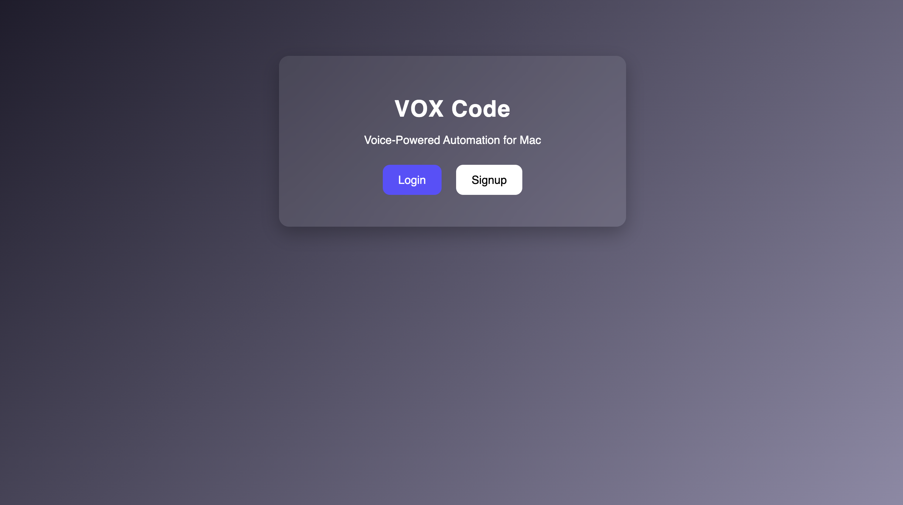
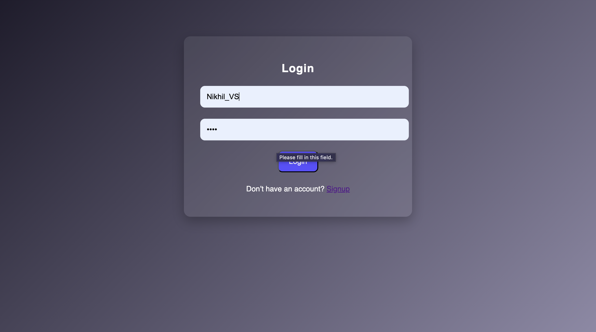
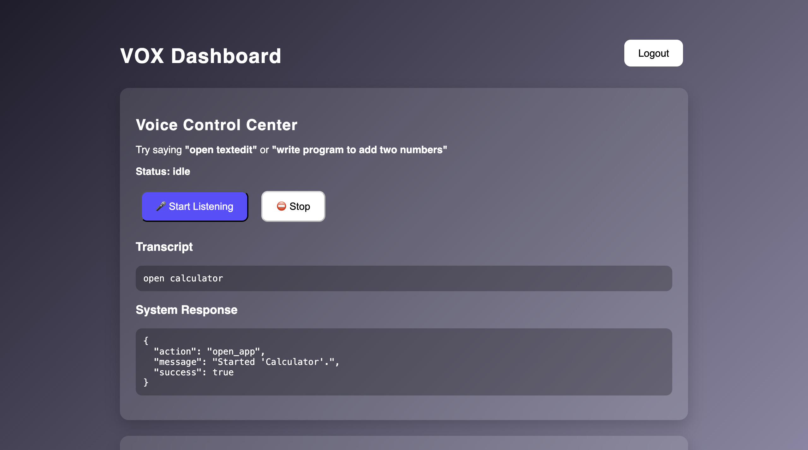
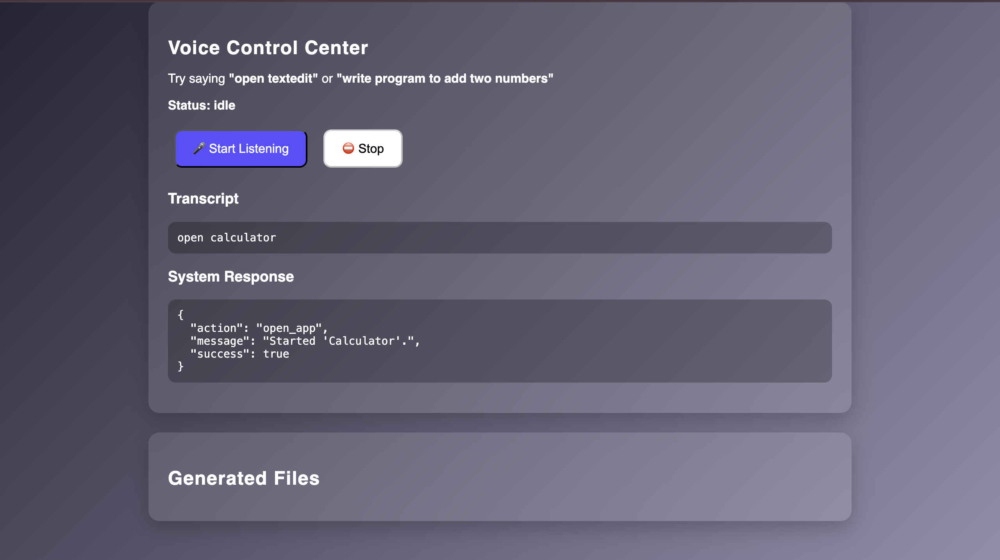

# VOX Code 🎙️

Voice-Powered Automation for Mac built using Flask, HTML, CSS, and JavaScript.

## 🌐 Live Demo

**Live Deployment:** https://voxcode.onrender.com/

## 🚀 Features

* Voice-controlled web interface
* Login Page
* Signup Page
* Dashboard Interface
* Generate Python programs through voice commands
* Download generated code files
* Modern responsive UI
* Flask backend

## 🛠️ Tech Stack

* Python
* Flask
* HTML5
* CSS3
* JavaScript
* Git & GitHub
* Render

## 📸 Screenshots

### Home Page



### Login Page



### Signup Page


### Dashboard




## ⚙️ Installation

```bash
git clone https://github.com/Nikhil-VS1811/VOXCode.git

cd VOXCode

python -m venv venv

source venv/bin/activate

pip install -r requirements.txt

python app.py
```

Open:

http://127.0.0.1:5000

## 📂 Project Structure

VOXCode/
│
├── app.py
├── requirements.txt
├── README.md
├── static/
├── templates/
├── generated/
└── screenshots/

## 👨‍💻 Author

Nikhil VS

GitHub: https://github.com/Nikhil-VS1811

## 📄 License

This project is licensed under the MIT License.
